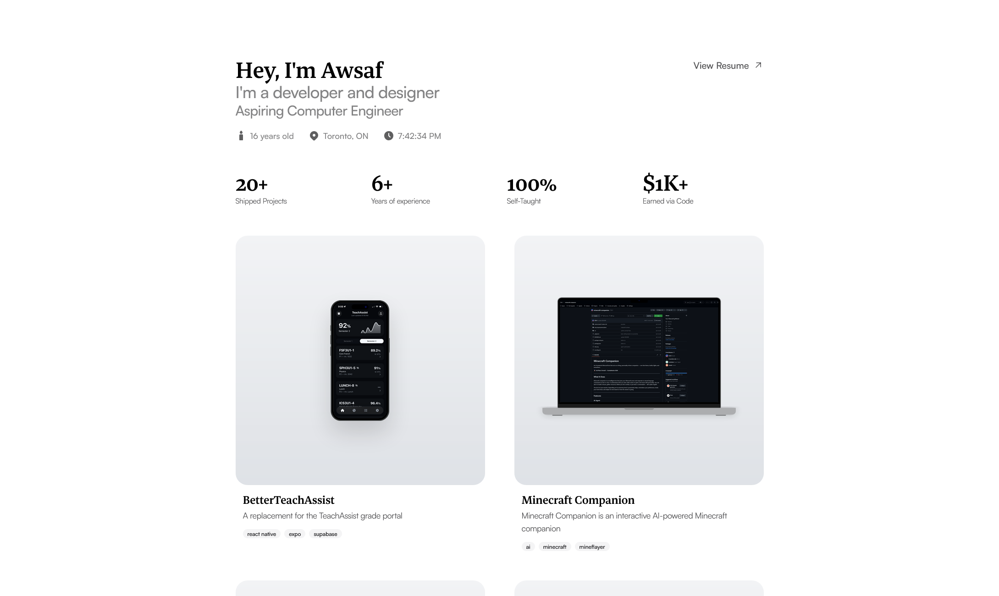

# My Portfolio

This is the source code for my portfolio! I aimed for a minimalistic design that took advantage of whitespace to make my projects
feel more premium. Furthermore, I incorporated several animations and micro-interactions to make the website feel more interactive and
engaging.

## Tech Stack

I used the following technologies to build my portfolio:
- Next.js
- React
- Tailwind CSS
- Framer Motion

My project pages were made using MDX and custom MDX components.

## Inspiration

- https://www.romancaseres.cloud/
    - Layout & design
- https://jaimec.co/
    - Micro interactions
    - Design
- https://www.arjun-r.com
    - Design
    - Graphics
- https://www.ngan-nguyen.com/
    - Case Study Grid
    - Animations
- https://ref.digital/
    - Font
    - ASCII art
- https://estrela.studio/
    - Layout
- https://guglieri.com/
    - Layout & design
    - White space
- https://ericsin.com/
    - Interactive icon
- https://toan.framer.website/
    - Animations & interactions