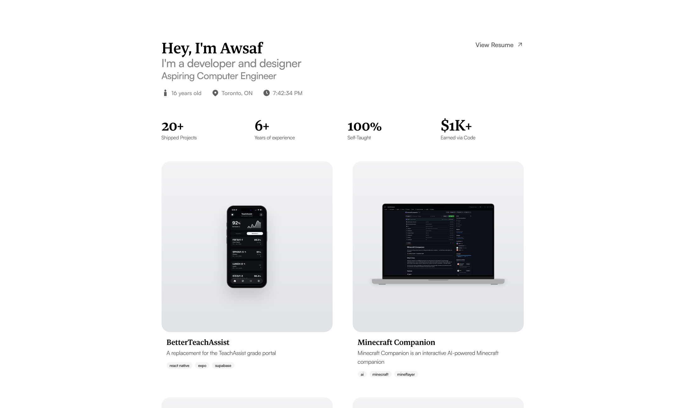

# My Portfolio

This is the source code for my portfolio! I aimed for a minimalistic design that took advantage of whitespace to make my projects
feel more premium. Furthermore, I incorporated several animations and micro-interactions to make the website feel more interactive and
engaging.



## Tech Stack

I used the following technologies to build my portfolio:
- Next.js
- React
- Tailwind CSS
- Framer Motion

My project pages were made using MDX and custom MDX components.

## Deployment

The app is ready to deploy as a standard Node.js Next.js application. Use Node
20.9 or newer and install dependencies from the lockfile:

```sh
pnpm install --frozen-lockfile
pnpm build
pnpm start
```

Before deploying, add the variables in `.env.example` to the production
environment. `SUPABASE_SERVICE_ROLE_KEY`, `ADMIN_PORTAL_KEY`, `NOTES_IP_SALT`,
and `DISCORD_NOTES_WEBHOOK_URL` must remain server-only; never prefix them with
`NEXT_PUBLIC_`. Generate long random values for the two secret values. The
`ADMIN_OWNER_EMAIL` value must match the owner email configured in the notes RLS
policies.

Apply the database migrations to the production Supabase project before the
first release:

```sh
supabase db push
```

The latest migration adds the doodle and hashed-IP fields used by the notes API,
an index for rate limiting, and removes direct public note inserts so that all
submissions pass through the server-side rate limit.

## Inspiration

- https://www.romancaseres.cloud/
    - Layout & design
- https://jaimec.co/
    - Micro interactions
    - Design
- https://www.arjun-r.com
    - Design
    - Graphics
- https://www.ngan-nguyen.com/
    - Case Study Grid
    - Animations
- https://ref.digital/
    - Font
    - ASCII art
- https://estrela.studio/
    - Layout
- https://guglieri.com/
    - Layout & design
    - White space
- https://ericsin.com/
    - Interactive icon
- https://toan.framer.website/
    - Animations & interactions
